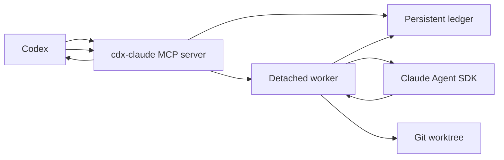

# cdx-claude Architecture

## Authority and evidence

Codex is the only authority that accepts, applies, validates, or reports delegated work. Claude outputs are evidence or patches. A Claude job never edits the parent workspace directly.

Current external contract evidence:

- Codex plugins use `.codex-plugin/plugin.json` and can bundle skills, MCP config, apps, hooks, and marketplace metadata. Marketplace entries point at plugin roots, and installed plugins run from `~/.codex/plugins/cache/$MARKETPLACE_NAME/$PLUGIN_NAME/$VERSION/` instead of source. `vendor:openai:codex-plugins:https://developers.openai.com/codex/plugins/build`
- The installed Codex plugin loader accepts `.mcp.json` in wrapped `mcpServers` camel-case form or as a direct server map, then normalizes each server config before exposure. `vendor:openai-codex:0.130.0:https://github.com/openai/codex/blob/2abdeb34d5b7a0bbdf082ce8be1d5dae6c645ffd/codex-rs/core-plugins/src/loader.rs#L76` and `vendor:openai-codex:0.130.0:https://github.com/openai/codex/blob/2abdeb34d5b7a0bbdf082ce8be1d5dae6c645ffd/codex-rs/core-plugins/src/loader.rs#L983`
- Codex marketplace files may live at `.agents/plugins/marketplace.json`, and current Codex CLI supports `codex plugin marketplace add <owner/repo>` with optional `--ref` and `--sparse`. Git subdirectory plugin sources are resolved by the Codex marketplace loader. `vendor:openai-codex:0.130.0:https://github.com/openai/codex/blob/2abdeb34d5b7a0bbdf082ce8be1d5dae6c645ffd/codex-rs/core-plugins/src/marketplace.rs#L21`, `vendor:openai-codex:0.130.0:https://github.com/openai/codex/blob/2abdeb34d5b7a0bbdf082ce8be1d5dae6c645ffd/codex-rs/core-plugins/src/marketplace.rs#L469`, and `vendor:openai-codex:0.130.0:https://github.com/openai/codex/blob/2abdeb34d5b7a0bbdf082ce8be1d5dae6c645ffd/codex-rs/core-plugins/src/marketplace.rs#L495`
- Codex derives non-curated plugin cache versions from `.codex-plugin/plugin.json` `version`, so npm package version, plugin manifest version, Git tag, and marketplace `ref` are one release identity. `vendor:openai-codex:0.130.0:https://github.com/openai/codex/blob/2abdeb34d5b7a0bbdf082ce8be1d5dae6c645ffd/codex-rs/core-plugins/src/store.rs#L168`
- `@anthropic-ai/claude-agent-sdk@0.2.138` exposes query/session/task/control primitives including `query`, `abortController`, `canUseTool`, `allowedTools`, `tools`, `permissionMode`, `maxBudgetUsd`, `pathToClaudeCodeExecutable`, `systemPrompt`, sandbox settings, and `Query.stopTask()`. `vendor:anthropic:claude-agent-sdk-0.2.138:https://platform.claude.com/docs/en/agent-sdk/typescript`, `node_modules:@anthropic-ai/claude-agent-sdk/sdk.d.ts:1216`, `node_modules:@anthropic-ai/claude-agent-sdk/sdk.d.ts:1447`, `node_modules:@anthropic-ai/claude-agent-sdk/sdk.d.ts:1494`, `node_modules:@anthropic-ai/claude-agent-sdk/sdk.d.ts:1503`, `node_modules:@anthropic-ai/claude-agent-sdk/sdk.d.ts:1581`, `node_modules:@anthropic-ai/claude-agent-sdk/sdk.d.ts:1718`, `node_modules:@anthropic-ai/claude-agent-sdk/sdk.d.ts:1776`, and `node_modules:@anthropic-ai/claude-agent-sdk/sdk.d.ts:2271`
- Claude Code and the Claude Agent SDK own authentication. Public users bring a locally supported Claude Code/Agent SDK authentication configuration; cdx-claude does not broker Claude.ai login or credentials. `vendor:anthropic:claude-code-sdk:https://docs.anthropic.com/en/docs/claude-code/sdk`
- Claude Code native sandboxing is the canonical shell-containment substrate for autonomous jobs. It uses OS-level enforcement, Seatbelt on macOS, and supports fail-closed startup through `sandbox.failIfUnavailable`. `vendor:anthropic:claude-code-sandboxing:https://code.claude.com/docs/en/sandboxing`, `node_modules:@anthropic-ai/claude-agent-sdk/sdk.d.ts:4991`, and `node_modules:@anthropic-ai/claude-agent-sdk/sdk.d.ts:4999`
- `@modelcontextprotocol/sdk@1.29.0` provides `McpServer` and `StdioServerTransport`, the wrapper-server primitives for this plugin MCP surface. `node_modules:@modelcontextprotocol/sdk/dist/esm/server/mcp.d.ts:14`
- Codex MCP stdio servers run as local child processes with configured command, arguments, environment, and optional `cwd`; Codex awaits each MCP `tools/call`, so non-blocking behavior returns a job id and continues in a detached worker. `vendor:openai-codex:0.130.0:https://github.com/openai/codex/blob/2abdeb34d5b7a0bbdf082ce8be1d5dae6c645ffd/codex-rs/rmcp-client/src/stdio_server_launcher.rs#L143` and `vendor:openai-codex:0.130.0:https://github.com/openai/codex/blob/2abdeb34d5b7a0bbdf082ce8be1d5dae6c645ffd/codex-rs/rmcp-client/src/rmcp_client.rs#L545`

## Canonical process edge

The MCP server is short-lived request handling. It validates request payloads, writes durable job state, spawns detached workers, and reads ledger artifacts for inspection tools. The worker owns Claude SDK execution and writes progress and results to the ledger.

## Public plugin package

The public GitHub repository is `Tiziano-AI/cdx-claude`. It owns both the npm runtime package and a Codex marketplace file at `.agents/plugins/marketplace.json`. The marketplace entry points Codex at the installable plugin subdirectory `./plugin` through a Git subdirectory source.

The installed plugin is cache-relative. `plugin/.mcp.json` launches `./bin/cdx-claude` with arguments `mcp serve` and `cwd: "."`. `plugin/bin/cdx-claude` is a small executable launcher that runs the version-pinned npm package `cdx-claude@0.1.0`. The launcher accepts `CDX_CLAUDE_NPM_SPEC` for release-candidate proof against a local `pnpm pack` tarball before npm publish. The launcher passes only an allowlisted environment to npm and may pass `CDX_CLAUDE_AUTH_ENV_FILE`, which is a path to a local auth dotenv file, not an auth secret. The plugin package does not commit a bundled Anthropic SDK artifact.

The npm package is the runtime owner. It ships the TypeScript build in `dist/`, the embedded delegate roles in `roles/`, and one public binary named `cdx-claude`. The hidden worker command is `cdx-claude __worker` and is not listed in help.

## Claude authentication boundary

cdx-claude supports two authentication ingress paths for the Claude Agent SDK:

- direct CLI/runtime invocation may inherit allowlisted Claude and cloud-provider auth variables from the current process;
- installed Codex plugin invocation passes only `CDX_CLAUDE_AUTH_ENV_FILE` through the npm launcher, then the runtime and detached worker load allowlisted variables from that file before invoking Claude.

The auth env file parser accepts shell-style `KEY=value` rows for allowlisted Claude/Anthropic, Bedrock, Vertex, Foundry, and local certificate/proxy variables needed by Claude Code. Unknown rows are rejected so auth typos fail closed. Values are passed to the Claude SDK environment and are not written to ledgers, events, or doctor output by cdx-claude. Prompts, Claude messages, diffs, and logs remain unredacted product data.

## Public MCP and CLI contracts

Public MCP tools:

- `claude_delegate_roles`: lists packaged delegate roles.
- `claude_delegate_start`: creates a job and returns immediately with `job_id`.
- `claude_delegate_list`: lists persisted jobs.
- `claude_delegate_status`: returns one persisted job record.
- `claude_delegate_tail`: returns recent event rows.
- `claude_delegate_result`: returns `result.md`, `receipt.json`, and patch metadata when present.
- `claude_delegate_diff`: refreshes and returns a worktree diff.
- `claude_delegate_stop`: requests stop and returns `stopping` until worker or recovery proof writes a terminal state.
- `claude_delegate_cleanup`: removes terminal worktrees and optional ledger artifacts.
- `claude_delegate_sandbox_canary`: starts a `patch_autonomous` canary job and returns expected proof markers.
- `claude_delegate_doctor`: reports local Claude, Node, ledger, role, plugin, and sandbox readiness.

Each MCP tool and CLI command returns one envelope:

- success: `{ "ok": true, "data": ..., "meta": { "schema_version": 1, "command": "...", "generated_at": "..." } }`
- failure: `{ "ok": false, "error": { "code": "...", "message": "...", "recoverable": true }, "meta": ... }`

The CLI mirrors the MCP surface for local debugging: `doctor`, `roles`, `jobs start/list/status/tail/result/diff/stop/cleanup`, `sandbox canary`, and `mcp serve`. Local-personal cache sync is not a public CLI path.
Public request decoding is strict. No-input tools reject extra MCP arguments and extra CLI flags or positionals. Single-job CLI commands reject trailing positional arguments instead of ignoring them.

Public job responses use a `JobView` projection. `job.json` persists a worker-token hash and the full appended role prompt for recovery and execution, but the raw worker token exists only in the private worker environment. `JobView` omits `worker_token_hash` and `agent_prompt` from `start`, `list`, `status`, `result`, `diff`, and `sandbox_canary` responses. Event tails are not a DLP boundary; they return Claude SDK event metadata as product data, but their public projection strips cdx-claude worker control identity keys such as `pid`, `worker_pid`, `worker_token`, and `worker_token_hash`.

## Request and ledger contracts

`claude_delegate_start` accepts:

- `cwd`: absolute target repository or workspace path. Relative paths are rejected.
- `prompt`: task text for Claude.
- `mode`: required `research`, `patch`, or `patch_autonomous`.
- `agent_role`: required packaged role name. Omitted or unknown roles are denied before a ledger row or worker is created.
- `allow_web`: optional switch that exposes Claude `WebFetch` and `WebSearch` tools. The default is no web tools.
- `title`: optional short human label.
- `model`: optional Claude model selector.
- `max_budget_usd`: optional SDK cost-estimate guard. It is not an Anthropic Console billing claim.

If `max_budget_usd` is omitted, `cdx-claude` sets a default SDK guard of `1`. Requests above `100` are rejected. The guard bounds SDK-reported usage for public tool calls; it is not a provider billing statement.

`cwd` must resolve to a git project or worktree root. `cdx-claude` denies filesystem root, the operator home directory, cdx-claude state, Codex state, broad user-control directories, and common credential roots such as `.codex`, `.claude`, `.config`, `.npm`, `.secrets`, `.ssh`, `.aws`, `.azure`, `.gcloud`, `.docker`, `.kube`, `.gnupg`, `.claude.json`, and `.gemini` before ledger or worker creation.

`job.json` contains `job_id`, `title`, `mode`, `status`, `cwd`, `execution_cwd`, timestamps, prompt, role metadata, worktree metadata, worker identity, Claude session/task ids, terminal metadata, and error fields. `events.jsonl` contains monotonic `{ seq, timestamp, type, summary, metadata }` rows. Other artifacts are `result.md`, `diff.patch`, `stdout.log`, `stderr.log`, and `receipt.json`.

A per-job lock owns status/event transitions. Terminal statuses are immutable. Active statuses are `starting`, `running`, and `stopping`; terminal statuses are `completed`, `failed`, `stopped`, and `stale`.

## Job modes and containment

`research` runs Claude in the target `cwd` with read/search/web tools only. Write tools and Bash are denied.

`patch` creates a detached git worktree under the ledger worktree root from the target repository `HEAD`. Claude may read, edit, and write inside that worktree only. Shell is not available.

`patch_autonomous` creates the same detached worktree as `patch`, enables Claude Code native sandboxing for Bash, and passes a scrubbed environment to the detached worker and SDK. Shell commands run only when SDK sandboxing is enabled with `failIfUnavailable: true`, `autoAllowBashIfSandboxed: true`, and `allowUnsandboxedCommands: false`. v0.1.0 does not claim network containment; network policy remains future work because Claude Code and provider access require network paths.

The plugin launcher also uses an allowlisted environment when invoking npm. It forwards only process basics, cdx-claude configuration, and an empty npm userconfig path; it does not pass the full Codex MCP process environment through to npm or the runtime.

A git worktree is version-control isolation, not a security sandbox. Claude Code sandboxing applies to Bash subprocesses and their children. Built-in Claude file tools remain governed by the explicit permission gate, so `Read`, `Edit`, `Write`, and `MultiEdit` resolve paths against the job execution root before the tool is allowed.

`cdx-claude` does not redact prompts, logs, events, diffs, or results. It is not a safety or DLP layer; it moves product data between Codex, local Claude Code, and the local ledger under the declared authority and isolation contract. Product-owned worker identity is control-plane material, not user data, and is not exposed in public responses.

## Packaged role catalogue

Every Claude delegate runs with a task-specific system prompt selected from the packaged role catalogue in `roles/`. The catalogue is a release snapshot of the upstream `cdx-agents` role TOMLs. `roles/manifest.json` records upstream provenance, role count, and per-role checksums.

`cdx-claude` requires `agent_role`, finds the role in `roles/manifest.json`, reads the full selected TOML from `roles/*.toml`, and appends it verbatim to Claude Code's default system prompt through `systemPrompt: { type: "preset", preset: "claude_code", append: ... }`. There is no default role selection in the product path.

## Release identity

One version controls the release: npm package version, plugin manifest version, plugin launcher npm spec, marketplace `ref`, and Git tag all match. The v0.1.0 public release supports macOS first. Linux and Windows remain experimental until direct Codex plugin proof and Claude sandbox proof exist on those platforms.

## Generated artifact exceptions

`roles/manifest.json` is a generated packaged-role catalogue snapshot and `pnpm-lock.yaml` is the package-manager lockfile. They are exempt from the routine source-file line and byte guard; their release proof is exact regeneration, checksum/package validation, and tarball content inspection rather than manual splitting.
