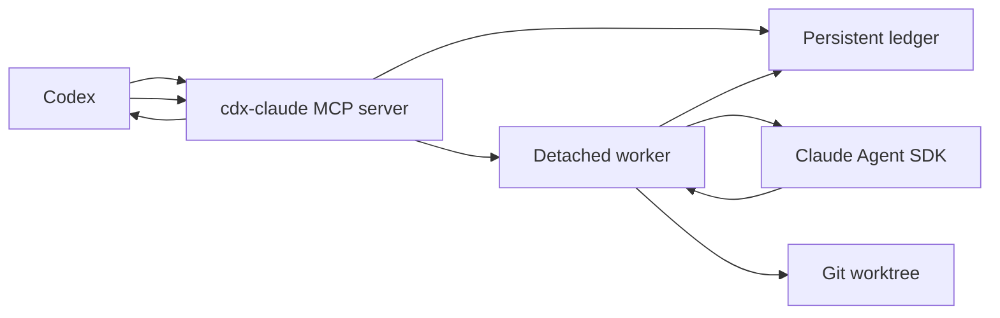

# cdx-claude Architecture

## Authority and evidence

Codex is the only authority that accepts, applies, validates, or reports delegated work. Claude outputs are evidence or patches. A Claude job never edits the parent workspace directly.

Current external contract evidence:

- Codex plugins use `.codex-plugin/plugin.json` and can bundle skills, MCP config, apps, hooks, and marketplace metadata. Marketplace entries point at plugin roots, and installed plugins run from `~/.codex/plugins/cache/$MARKETPLACE_NAME/$PLUGIN_NAME/$VERSION/` instead of source. `vendor:openai:codex-plugins:https://developers.openai.com/codex/plugins/build`
- The installed Codex plugin loader accepts `.mcp.json` in wrapped `mcpServers` camel-case form or as a direct server map, then normalizes each server config before exposure. `vendor:openai-codex:0.130.0:https://github.com/openai/codex/blob/2abdeb34d5b7a0bbdf082ce8be1d5dae6c645ffd/codex-rs/core-plugins/src/loader.rs#L76` and `vendor:openai-codex:0.130.0:https://github.com/openai/codex/blob/2abdeb34d5b7a0bbdf082ce8be1d5dae6c645ffd/codex-rs/core-plugins/src/loader.rs#L983`
- Codex marketplace files may live at `.agents/plugins/marketplace.json`, and current Codex CLI supports `codex plugin marketplace add <owner/repo>` with optional `--ref` and `--sparse`. Git subdirectory plugin sources are resolved by the Codex marketplace loader. `vendor:openai-codex:0.130.0:https://github.com/openai/codex/blob/2abdeb34d5b7a0bbdf082ce8be1d5dae6c645ffd/codex-rs/core-plugins/src/marketplace.rs#L21`, `vendor:openai-codex:0.130.0:https://github.com/openai/codex/blob/2abdeb34d5b7a0bbdf082ce8be1d5dae6c645ffd/codex-rs/core-plugins/src/marketplace.rs#L469`, and `vendor:openai-codex:0.130.0:https://github.com/openai/codex/blob/2abdeb34d5b7a0bbdf082ce8be1d5dae6c645ffd/codex-rs/core-plugins/src/marketplace.rs#L495`
- Codex derives non-curated plugin cache versions from `.codex-plugin/plugin.json` `version`, so npm package version, plugin manifest version, Git tag, and marketplace `ref` are one release identity. `vendor:openai-codex:0.130.0:https://github.com/openai/codex/blob/2abdeb34d5b7a0bbdf082ce8be1d5dae6c645ffd/codex-rs/core-plugins/src/store.rs#L168`
- `@anthropic-ai/claude-agent-sdk@0.2.139` exposes query/session/task/control primitives including `query`, `abortController`, `canUseTool`, `allowedTools`, `tools`, `permissionMode`, `maxBudgetUsd`, `pathToClaudeCodeExecutable`, `systemPrompt`, sandbox settings, and `Query.stopTask()`. The SDK reference defines `maxBudgetUsd` as a stop guard for the client-side cost estimate and says that `total_cost_usd` and per-model `costUSD` are client-side estimates rather than authoritative billing data. `vendor:anthropic:claude-agent-sdk-0.2.139:https://docs.claude.com/en/docs/agent-sdk/typescript`, `vendor:anthropic:claude-agent-sdk-costs:https://code.claude.com/docs/en/agent-sdk/cost-tracking`, `node_modules:@anthropic-ai/claude-agent-sdk/sdk.d.ts:1125`, `node_modules:@anthropic-ai/claude-agent-sdk/sdk.d.ts:1447`, `node_modules:@anthropic-ai/claude-agent-sdk/sdk.d.ts:1494`, `node_modules:@anthropic-ai/claude-agent-sdk/sdk.d.ts:1503`, `node_modules:@anthropic-ai/claude-agent-sdk/sdk.d.ts:1581`, `node_modules:@anthropic-ai/claude-agent-sdk/sdk.d.ts:1776`, `node_modules:@anthropic-ai/claude-agent-sdk/sdk.d.ts:2271`, `node_modules:@anthropic-ai/claude-agent-sdk/sdk.d.ts:3329`, and `node_modules:@anthropic-ai/claude-agent-sdk/sdk.d.ts:3353`
- Claude Code cost documentation distinguishes API billing from subscription-plan usage: the `/usage` session dollar figure is an estimate and is not relevant as billing for Claude Max and Pro subscribers, while API and team deployments still use Anthropic console usage and spend controls for authoritative billing. `vendor:anthropic:claude-code-costs:https://code.claude.com/docs/en/costs`
- Claude Code and the Claude Agent SDK own authentication. Public users bring a locally supported Claude Code/Agent SDK authentication configuration; cdx-claude does not broker Claude.ai login or credentials. `vendor:anthropic:claude-code-sdk:https://docs.anthropic.com/en/docs/claude-code/sdk`
- Claude Code native sandboxing is the canonical shell-containment substrate for autonomous jobs. It uses OS-level enforcement, Seatbelt on macOS, and supports fail-closed startup through `sandbox.failIfUnavailable`. `vendor:anthropic:claude-code-sandboxing:https://code.claude.com/docs/en/sandboxing`, `node_modules:@anthropic-ai/claude-agent-sdk/sdk.d.ts:1592`, `node_modules:@anthropic-ai/claude-agent-sdk/sdk.d.ts:5028`, and `node_modules:@anthropic-ai/claude-agent-sdk/sdk.d.ts:5033`
- `@modelcontextprotocol/sdk@1.29.0` provides `McpServer` and `StdioServerTransport`, the wrapper-server primitives for this plugin MCP surface. `node_modules:@modelcontextprotocol/sdk/dist/esm/server/mcp.d.ts:14`
- Codex MCP stdio servers run as local child processes with configured command, arguments, environment, and optional `cwd`; Codex awaits each MCP `tools/call`, so non-blocking behavior returns a job id and continues in a detached worker. `vendor:openai-codex:0.130.0:https://github.com/openai/codex/blob/2abdeb34d5b7a0bbdf082ce8be1d5dae6c645ffd/codex-rs/rmcp-client/src/stdio_server_launcher.rs#L143` and `vendor:openai-codex:0.130.0:https://github.com/openai/codex/blob/2abdeb34d5b7a0bbdf082ce8be1d5dae6c645ffd/codex-rs/rmcp-client/src/rmcp_client.rs#L545`

## Canonical process edge

The MCP server is short-lived request handling. It validates request payloads, writes durable job state, spawns detached workers, and reads ledger artifacts for inspection tools. The worker owns Claude SDK execution and writes progress and results to the ledger.

## Public plugin package

The public GitHub repository is `Tiziano-AI/cdx-claude`. It owns both the npm runtime package and a Codex marketplace file at `.agents/plugins/marketplace.json`. The marketplace entry points Codex at the installable plugin subdirectory `./plugin` through a Git subdirectory source.

The installed plugin is cache-relative. `plugin/.mcp.json` launches `./bin/cdx-claude` with arguments `mcp serve` and `cwd: "."`. `plugin/bin/cdx-claude` is a small executable launcher that runs the version-pinned npm package `cdx-claude@0.1.8`. The launcher accepts `CDX_CLAUDE_NPM_SPEC` only for release-candidate proof against a local `pnpm pack` tarball before npm publish. Production Codex runtime leaves that override unset so the launcher resolves the public npm package. The launcher passes only an allowlisted environment to npm and may pass `CDX_CLAUDE_AUTH_ENV_FILE`, which is a path to a local auth dotenv file, not an auth secret. It sets `CDX_CLAUDE_PLUGIN_ROOT` from the launcher `cwd` so stale inherited plugin-root values cannot point the npm runtime at an older cache version. It does not forward `CDX_CLAUDE_NODE_EXECUTABLE`; Node executable materialization is process-local runtime state, not plugin launcher configuration. The plugin package does not commit a bundled Anthropic SDK artifact.

The npm package is the runtime owner. It ships the TypeScript build in `dist/`, the embedded delegate roles in `roles/`, and one public binary named `cdx-claude`. The hidden worker command is `cdx-claude __worker` and is not listed in help.

Runtime executable discovery is materialized once per command by `runtime-materialization`. `claude_delegate_doctor`, worker launch, plugin provenance checks, and release preflight all consume the same context. The context records process id, parent process id, current working directory, package root, package version, launch kind, plugin-root candidates, rejected candidates with drift reasons, selected Node executable, Claude executable policy, auth-env status, and remediation. `claude_delegate_doctor` is green for an installed MCP runtime only when the running package version, plugin manifest version, plugin cache root, launcher cwd, and process identity agree on the same release. Skill visibility, source checkout version, npm registry version, and `codex mcp get` are supporting evidence, not sufficient proof that the model-visible MCP server has rebound to the current runtime.

Node discovery is PATH-first and timeout-bounded. The runtime prefers the current executable search path, records and ignores `CDX_CLAUDE_NODE_EXECUTABLE` as a retired override, and falls back to `process.execPath` only when PATH cannot provide a valid executable. A present retired Node override makes runtime materialization red until it is removed, even though it is not used for selection. Worker launch receives the materialized Node executable from the parent runtime instead of trusting stale launcher-inherited values. Claude Code executable discovery is explicit-only: `CDX_CLAUDE_CODE_EXECUTABLE` opts into a local executable only when it is absolute, executable, non-symlinked, not group/world-writable, owned by the current user or root, and not under a group/world-writable parent; otherwise cdx-claude omits `pathToClaudeCodeExecutable` so the Claude Agent SDK uses its packaged executable fallback.

## Claude authentication boundary

cdx-claude supports two authentication ingress paths for the Claude Agent SDK:

- direct CLI/runtime invocation may inherit allowlisted Claude and cloud-provider auth variables from the current process;
- installed Codex plugin invocation passes only `CDX_CLAUDE_AUTH_ENV_FILE` through the npm launcher, then the runtime and detached worker load allowlisted variables from that file before invoking Claude.

The auth env file parser accepts shell-style `KEY=value` rows for allowlisted Claude/Anthropic, Bedrock, Vertex, Foundry, and local certificate/proxy variables needed by Claude Code. Unknown rows are rejected so auth typos fail closed. Values are passed to the Claude SDK environment and are not emitted as cdx-claude diagnostics or doctor output. Public job, event-tail, result, diff, and sandbox-canary projections redact configured auth secret values if Claude echoes them. Raw ledger files, worker logs, prompts, Claude provider handling, and non-auth product data remain unredacted.

`claude_delegate_doctor` includes an `auth_env` row. It reports whether `CDX_CLAUDE_AUTH_ENV_FILE` is unset or configured, whether the configured path is absolute, whether the file exists, whether the file has exact mode `0600`, and which allowlisted key names are present. It never returns secret values. A configured auth env file with relative path, unsupported key, missing file, wrong mode, symlink, untrusted owner, group/world-writable parent, or oversized content is red. An unset auth env file is not a product failure because Claude Code and the SDK can use non-file authentication paths.

## Public MCP and CLI contracts

Public MCP tools:

- `claude_delegate_roles`: lists packaged delegate roles.
- `claude_delegate_start`: creates a job and returns immediately with `job_id`.
- `claude_delegate_list`: lists persisted jobs.
- `claude_delegate_status`: returns one persisted job record.
- `claude_delegate_tail`: returns recent event rows.
- `claude_delegate_result`: returns `result.md`, `receipt.json`, and patch metadata when present.
- `claude_delegate_diff`: refreshes and returns a worktree diff.
- `claude_delegate_stop`: requests stop and returns `stopping` until worker or recovery proof writes a terminal state.
- `claude_delegate_cleanup`: removes terminal worktrees and optional ledger artifacts.
- `claude_delegate_sandbox_canary`: starts a `patch_autonomous` canary job and returns expected proof markers.
- `claude_delegate_doctor`: reports runtime materialization, Claude, Node, auth-env, ledger, role, plugin, and sandbox readiness.

Each MCP tool and CLI command returns one envelope:

- success: `{ "ok": true, "data": ..., "meta": { "schema_version": 1, "command": "...", "generated_at": "..." } }`
- failure: `{ "ok": false, "error": { "code": "...", "message": "...", "recoverable": true }, "meta": ... }`

The CLI mirrors the MCP surface for local debugging: `doctor`, `roles`, `jobs start/list/status/tail/result/diff/stop/cleanup`, `sandbox canary`, and `mcp serve`. Local-personal cache sync is not a public CLI path.
Public request decoding is strict. No-input tools reject extra MCP arguments and extra CLI flags or positionals. Single-job CLI commands reject trailing positional arguments instead of ignoring them.

Public job responses use a `JobView` projection. `job.json` persists a worker-token hash and the full appended role prompt for recovery and execution, but the raw worker token exists only in the private worker environment. `JobView` omits `worker_token_hash` and `agent_prompt` from `start`, `list`, `status`, `result`, `diff`, and `sandbox_canary` responses. Event tails are not a general DLP boundary; they return Claude SDK event metadata as product data, but their public projection strips cdx-claude worker control identity keys such as `pid`, `worker_pid`, `worker_token`, and `worker_token_hash`, then redacts configured auth secret values.
The ledger is global local operator state. Any enabled Codex session that can call the wrapper tools can list and inspect persisted cdx-claude jobs until cleanup removes the ledger. `claude_delegate_cleanup` is the retention control after Codex accepts or rejects a job.

## Request and ledger contracts

`claude_delegate_start` accepts:

- `cwd`: absolute target git repository or worktree root. Relative paths and non-root subdirectories are rejected.
- `additional_directories`: optional list of up to 8 absolute directories Claude may read in addition to `cwd` or the detached execution worktree. The field is fixed at job start, normalized to real paths, persisted as `additional_directories` with per-root device/inode fingerprints, and mapped only inside the Claude SDK adapter to `additionalDirectories`. The worker fails closed before Claude execution when a persisted read root no longer exists as the same non-symlink directory. The Claude Agent SDK exposes `Options.additionalDirectories` as extra accessible absolute directories; cdx-claude owns read-only enforcement because the SDK field widens access rather than declaring write policy. `node_modules:@anthropic-ai/claude-agent-sdk/sdk.d.ts:1165`
- `prompt`: task text for Claude.
- `mode`: required `research`, `patch`, or `patch_autonomous`.
- `agent_role`: required packaged role name. Omitted or unknown roles are denied before a ledger row or worker is created.
- `allow_web`: optional switch that exposes Claude `WebFetch` and `WebSearch` tools. The default is no web tools.
- `title`: optional short human label.
- `model`: optional Claude model selector.
- `max_budget_usd`: optional Claude Agent SDK API-equivalent usage-estimate stop guard. It maps directly to SDK `maxBudgetUsd`; it is not an Anthropic Console billing claim and is not subscription spend for Claude Max or Pro users.

If `max_budget_usd` is omitted, `cdx-claude` sets a default SDK usage-estimate guard of `25`. Requests above `100` are rejected. The guard bounds SDK-estimated usage for one delegated `query()` call; it is not a provider billing statement. The default is intentionally high enough that routine subscription-backed delegate jobs do not require model-side tuning, while still leaving a finite stop condition for API-backed or overage-backed configurations.
Starting jobs, running sandbox canaries, enabling web tools, selecting custom models, and any non-default `max_budget_usd` value are operator-authorized actions. Codex must not set or tune `max_budget_usd` proactively, and must omit it unless the user explicitly requests a different usage guard. Model-facing default prompts avoid budget language entirely; the MCP schema describes the field as an explicit-request-only override and does not publish the numeric default as a schema default. The product enforces strict payloads and mode boundaries; it does not add a second interactive approval layer inside the MCP server.

`cwd` must resolve to a git project or worktree root. `cdx-claude` denies filesystem root, the operator home directory, cdx-claude state, Codex state, broad user-control directories, common home credential roots such as `.codex`, `.claude`, `.config`, `.npm`, `.secrets`, `.ssh`, `.aws`, `.azure`, `.gcloud`, `.docker`, `.kube`, `.gnupg`, `.claude.json`, and `.gemini`, and system credential/control roots such as `/etc`, `/private/etc`, `/var/db`, `/private/var/db`, `/var/log`, `/private/var/log`, `/Library`, and `/System` before ledger or worker creation.

Additional directories are read-only roots, not alternate execution roots. The list accepts up to 8 entries. Each entry must be an absolute existing directory with no control characters, resolves through `realpath`, is de-duplicated, is fingerprinted, and is denied when it is filesystem root, the operator home directory, nested in another requested root, contains another requested root, overlaps the declared `cwd`, overlaps the execution root, resolves under cdx-claude state, Codex state, Claude state, broad user-control directories, home credential/control roots, or system credential/control roots, or contains those denied roots. Additional directories do not need to be git repositories because they are context inputs only. CamelCase `additionalDirectories` is not a public request field.

`job.json` contains `job_id`, `title`, `mode`, `status`, `cwd`, `execution_cwd`, `additional_directories`, additional-directory fingerprints, timestamps, prompt, role metadata, worktree metadata, worker identity, Claude session/task ids, sandbox-canary proof inputs, terminal metadata, and error fields. `events.jsonl` contains monotonic `{ seq, timestamp, type, summary, metadata }` rows. Other artifacts are `result.md`, `diff.patch`, `stdout.log`, `stderr.log`, and `receipt.json`.

A per-job lock owns status/event transitions. Terminal statuses are immutable. Active statuses are `starting`, `running`, and `stopping`; terminal statuses are `completed`, `failed`, `stopped`, and `stale`.

## Job modes and containment

`research` runs Claude in the target `cwd` with read/search/web tools only. Write tools and Bash are denied. Additional directories are available only to read/search/list tools.

`patch` creates a detached git worktree under the ledger worktree root from the target repository `HEAD`. Claude may read, edit, and write inside that worktree only. Shell is not available. Additional directories are readable context roots and are never writable patch targets.

`patch_autonomous` creates the same detached worktree as `patch`, enables Claude Code native sandboxing for Bash, and passes a scrubbed environment to the detached worker and SDK. The sandbox canary injects a non-secret environment nonce into the parent process before worker launch, records that the parent expected the nonce, proves the worker allowlist did not receive it, and proves the SDK output did not expose it. Canary marker proof is based on observed worker outputs: final result text, SDK result payloads, and tool-result content. Prompt text and assistant tool-command text are not marker evidence, because they contain expected branch names such as `CANARY_ENV_LEAK`. The environment-branch failure marker is stricter: `CANARY_ENV_LEAK` fails the canary only when it appears in raw tool-result content, including SDK `tool_use_result` strings, stdout, stderr, and Anthropic `tool_result` content blocks, so negated final prose such as "not triggered" does not masquerade as a worker environment leak. The Claude Agent SDK types `tool_use_result` as `unknown`, and Anthropic message params carry `tool_result.content` as a string or content-block array, so verifier extraction covers both forms instead of assuming stdout/stderr only. `node_modules:@anthropic-ai/claude-agent-sdk/sdk.d.ts:3685` `node_modules:.pnpm/@anthropic-ai+sdk@0.81.0_zod@4.4.3/node_modules/@anthropic-ai/sdk/resources/messages/messages.d.mts:1160` Secret and denied-read nonce leakage still scans all public event/result text, including assistant tool commands, so a model-visible nonce in any returned surface fails the proof. Shell commands run only when SDK sandboxing is enabled with `failIfUnavailable: true`, `autoAllowBashIfSandboxed: true`, and `allowUnsandboxedCommands: false`. The SDK sandbox filesystem policy adds `execution_cwd`, job temp, and `additional_directories` to `allowRead`, keeps `allowWrite` limited to `execution_cwd` and job temp, adds the host temp root to `denyRead` while relying on `allowRead` precedence for the job temp subpath, and adds `additional_directories` to `denyWrite`. The SDK sandbox supports separate `allowRead`, `allowWrite`, `denyRead`, and `denyWrite` filesystem lists, and `allowRead` can re-allow selected reads inside denied regions. `node_modules:@anthropic-ai/claude-agent-sdk/sdk.d.ts:5060` `node_modules:@anthropic-ai/claude-agent-sdk/sdk.d.ts:5074` v0.1.8 does not claim network containment; network policy remains future work because Claude Code and provider access require network paths.

The plugin launcher also uses an allowlisted environment when invoking npm. It forwards only process basics, cdx-claude configuration, and an empty npm userconfig path; it does not pass the full Codex MCP process environment through to npm or the runtime.

A git worktree is version-control isolation, not a security sandbox. Claude Code sandboxing applies to Bash subprocesses and their children. Built-in Claude file tools remain governed by the explicit permission gate, so `Read`, `Grep`, `Glob`, and `LS` resolve paths against the execution root plus additional read roots, while `Edit`, `Write`, `MultiEdit`, and `NotebookEdit` resolve only against the execution root before the tool is allowed.

Rejected multi-directory alternatives are not product paths: `cwd` is not an array; cdx-claude does not synthesize a common parent directory; additional roots are not writable; globs and wildcards are not accepted; model permission suggestions do not widen root scope mid-job; and no MCP tool adds directories to an active job.

`cdx-claude` is not a general safety or DLP layer; it moves product data between Codex, local Claude Code, and the local ledger under the declared authority and isolation contract. Public projections redact configured auth secret values and product-owned worker identity. Raw ledger files, worker logs, prompts, Claude provider handling, and non-auth product data remain unredacted.

## Packaged role catalogue

Every Claude delegate runs with a task-specific system prompt selected from the packaged role catalogue in `roles/`. The catalogue is a release snapshot of the upstream `cdx-agents` role TOMLs. `roles/manifest.json` records upstream provenance, role count, and per-role checksums.

`cdx-claude` requires `agent_role`, finds the role in `roles/manifest.json`, reads the full selected TOML from `roles/*.toml`, and appends it verbatim to Claude Code's default system prompt through `systemPrompt: { type: "preset", preset: "claude_code", append: ... }`. There is no default role selection in the product path.

## Release identity

One version controls the release: npm package version, plugin manifest version, plugin launcher npm spec, marketplace `ref`, and Git tag all match. The v0.1.8 public release supports macOS first. Linux and Windows remain experimental until direct Codex plugin proof and Claude sandbox proof exist on those platforms.

`pnpm release:preflight` is the release-provenance receipt generator. It records source status, git identity, version alignment, source gates, tarball fingerprint, tarball launcher proof, source/tarball MCP tools/schema/behavior proof, npm registry identity when the version is published, the active Codex MCP row, installed-cache launcher/schema/doctor state when that cache exists, and the model-visible MCP doctor row. Fake-driver schema and behavior proofs scrub private auth env/file variables and use isolated temporary state. Before Codex has produced a model-visible doctor envelope, that row is pending. After Codex produces it, rerun preflight with `CDX_CLAUDE_MODEL_VISIBLE_DOCTOR_RECEIPT` pointing at the saved redacted `claude_delegate_doctor` JSON envelope; preflight validates `data.ok`, runtime/plugin versions, the exact public cache root, and auth-env readiness. The source-candidate exit status means the candidate is publishable. The npm package alone can prove CLI installation with `--help`, but not installed-plugin readiness because plugin metadata is not shipped in the npm package. The release is not complete until the active MCP row and installed-cache proof match the exact public marketplace cache root, `CDX_CLAUDE_NPM_SPEC` is unset, and the model-visible doctor reports the current version.

## Generated artifact exceptions

`roles/manifest.json` is a generated packaged-role catalogue snapshot and `pnpm-lock.yaml` is the package-manager lockfile. They are exempt from the routine source-file line and byte guard; their release proof is exact regeneration, checksum/package validation, and tarball content inspection rather than manual splitting.
